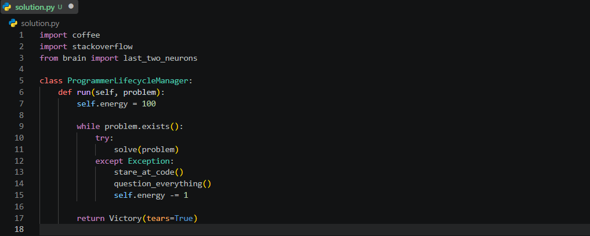

<div align="center">

# algo-solutions-python

<p align="center">
    
</p>

[](#)
[](#)

[](https://leetcode.com)
[](https://www.codewars.com)
[](https://www.hackerrank.com)
[](https://www.geeksforgeeks.org)

**A personal collection of my Python solutions to algorithm problems from LeetCode, Codewars, HackerRank, and GeeksforGeeks.**

</div>

## Structure

Solutions are organized by year. Each file is named `practice<n>` in the order I solved them.
```
algo-solutions-python/
├── practice_problem_solutions (2025)/
│   ├── practice1.py
│   ├── practice2.py
│   └── ...
├── practice_problem_solutions (2026)/
│   ├── practice1.py
│   ├── practice2.py
│   └── ...
```

Each file usually includes the problem source and a short note at the top as a comment.

---

## License

Distributed under the MIT License. See `LICENSE` for details.

---

&copy; 2026 Huerte. All Rights Reserved.
